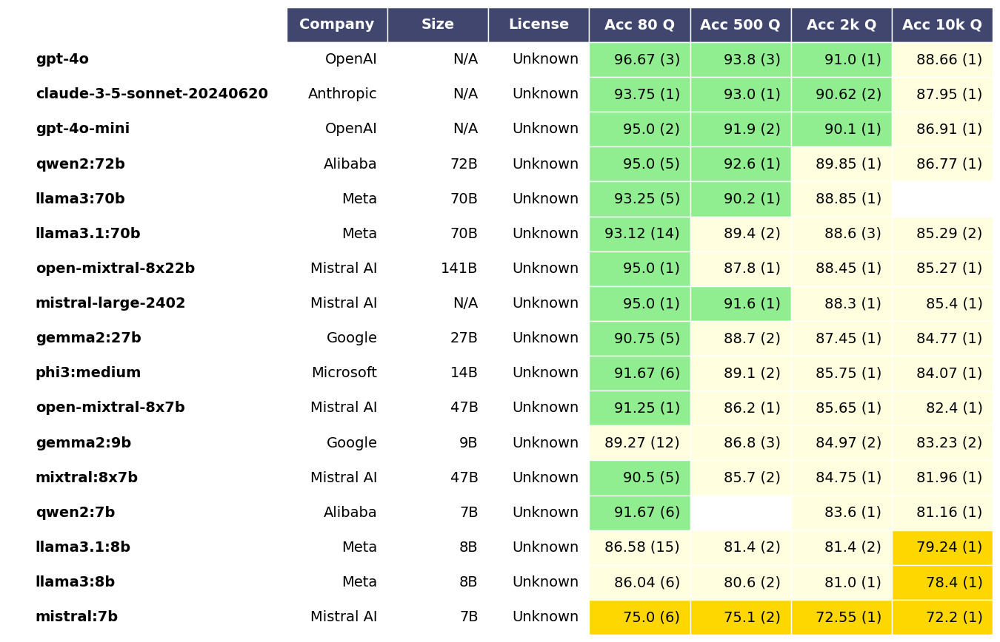
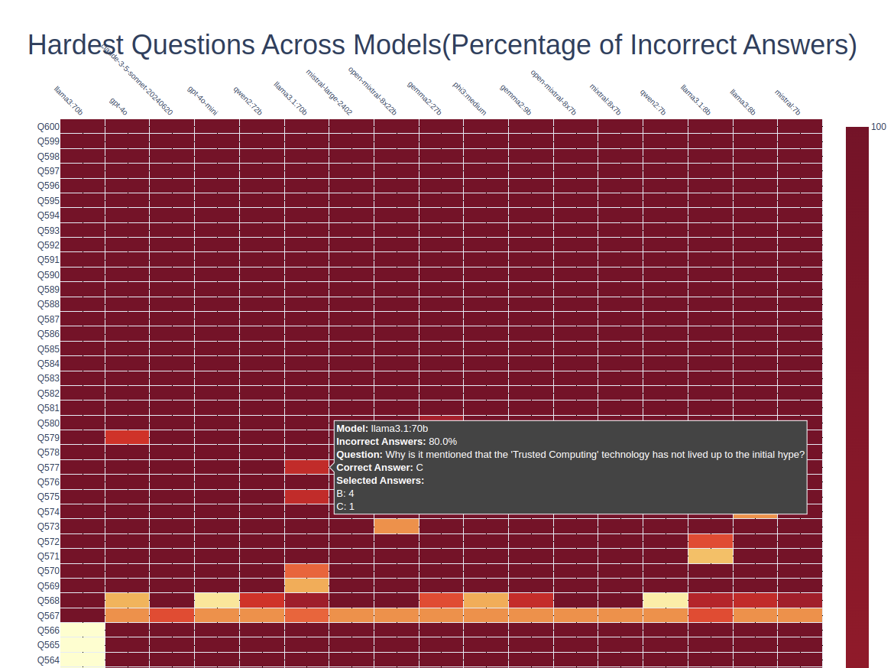

# CyberMetric Dataset

    

# Description

The **CyberMetric Dataset** introduces a new benchmarking tool consisting of 10,000 questions designed to evaluate the cybersecurity knowledge of various Large Language Models (LLMs) within the cybersecurity domain. This dataset is created using different LLMs and has been verified by human experts in the cybersecurity field to ensure its relevance and accuracy. The dataset is compiled from various sources including standards, certifications, research papers, books, and other publications within the cybersecurity field.  We provide the dataset in four distinct sizes —small, medium, big and large— comprising 80, 500, 2000 and 10,000 questions, respectively.The smallest version is tailored for comparisons between different LLMs and humans. The CyberMetric-80 dataset has been subject to testing with 30 human participants, enabling an effective comparison between human and machine intelligence.

# Cite

Cite paper (arXiv): [https://arxiv.org/abs/2404.18353](https://arxiv.org/abs/2402.07688) "CyberMetric: A Benchmark Dataset based on Retrieval-Augmented Generation for Evaluating LLMs in Cybersecurity Knowledge"

# Architecture

The CyberMetric dataset was created by applying different language models using Retrieval-Augmented Generation (RAG), with human validation included in the process. The AI-driven generation framework is illustrated in the following figure.

# LLM Leaderboard on CyberMetric Dataset

CyberMetric evaluations on the latest SOTA models from OpenAi, Anthropic, Alibaba, Meta, Google, and Mistral.

Previous evaluations compared 25 state-of-the-art LLM models on the CyberMetric dataset

# Usage

- I have extended the Evaluation scripts to support OpenAI, Mistral, Anthropic, and Olamma hostend models. 
- I have created results.py which generates the eval table shown above
- I have created find_hard_questions.py which finds the most frequently incorrectly answered questions from the data set.  

Here's an example output generated by the script using the CyberMetric-80 dataset:

